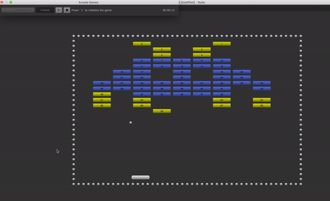

# Arcade Game for Nuke

Play Arcade Games in Foundry Nuke



## Installing

Copy the Python module `./source/arcade_nuke` into your personal `~/.nuke`
folder (or update your `NUKE_PATH` environment variable) and add the following
`menu.py` file:

```python
import nuke

import arcade_nuke

menu = nuke.menu("Nuke")
menu.addCommand("Arcade/Start Playing...", arcade_nuke.open_dialog)

```

see also: [Defining the Nuke Plug-in Path](https://learn.foundry.com/nuke/content/comp_environment/configuring_nuke/defining_nuke_plugin_path.html)
